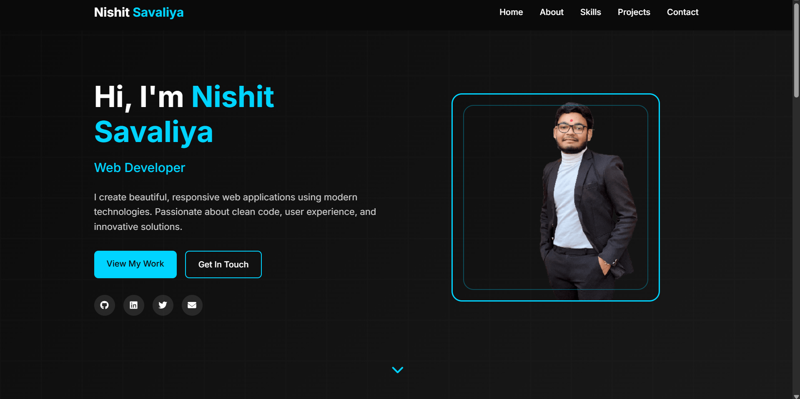
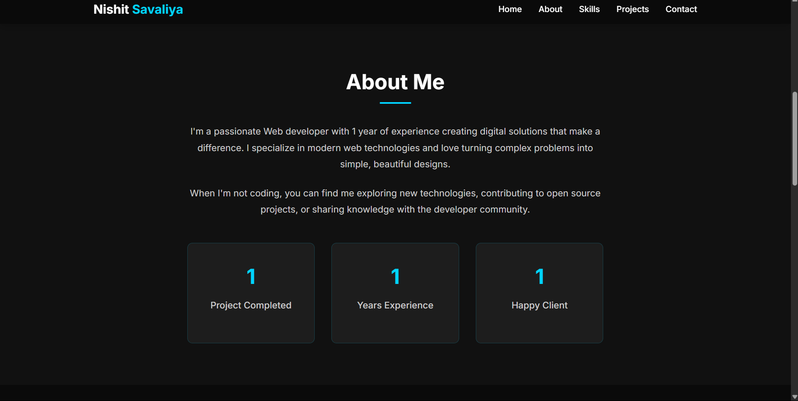

# 📱 Portfolio Website (Responsive Design)

A modern and responsive **Portfolio Website** built with **HTML5**, **CSS3**, and **JavaScript**. It showcases a clean, professional design with smooth animations and mobile-first approach for web developers to present their skills and projects.

## 🔗 Live Demo

• [Portfolio Website](https://nishit3116.github.io/CODECRAFT_WD_01)

## 📸 Project Demo

### Desktop View - Homepage

*Clean and modern homepage design*

### Desktop View - Full Portfolio

*Complete portfolio showcase with all sections*

## ✨ Features

• 📱 **Fully responsive design** - Works on all devices  
• 🎨 **Modern dark theme** with smooth animations  
• 🚀 **Fast loading** and optimized performance  
• 📧 **Contact form** with form validation  
• 💼 **Project showcase** with interactive cards  
• 🔍 **SEO optimized** with meta tags  
• ⚡ **Smooth scrolling** navigation  

## 🛠️ Tech Stack

**Frontend:**
• 🌐 HTML5  
• 🎨 CSS3  
• ⚡ Vanilla JavaScript  

**Design:**
• 🎯 Font Awesome Icons  
• 🔤 Google Fonts (Inter)  
• 📱 Mobile-First Responsive Design  

## 🚀 Installation

### 1. Clone the Repo

```bash
git clone https://github.com/Nishit3116/CODECRAFT_WD_01.git
cd CODECRAFT_WD_01
```

### 2. Open in Browser

```bash
# Simply open index.html in your browser
# Or use live server in VS Code
```

### 3. Customize Content

> Make sure to update your personal information in `index.html` and add your own images in the `images/` folder.

## 📁 Project Structure

```
CODECRAFT_WD_01/
├── 📄 index.html          # Main HTML file
├── 🎨 style.css           # CSS styling
├── ⚡ script.js           # JavaScript functionality
├── 📁 images/             # Image assets
│   ├── 🖼️ image.png       # Profile image
│   ├── 📸 portfolio-desktop-1.png
│   └── 📸 portfolio-desktop-2.png
├── 📋 package.json        # Project metadata
└── 📖 README.md           # Project documentation
```

## 🚀 Deployment Info

• 🌐 **Frontend**: Deployed on GitHub Pages  
• 📱 **Responsive**: Works on all screen sizes  
• ⚡ **Performance**: Optimized for fast loading  

## 👨‍💻 Author

Built with ❤️ by [Nishit Savaliya](https://github.com/Nishit3116)

## 📄 License

This project is licensed under the **MIT License** - see the [LICENSE](LICENSE) file for details.

---

⭐ **Star this repo** if you found it helpful!
